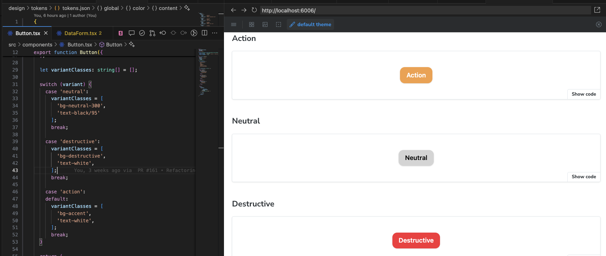
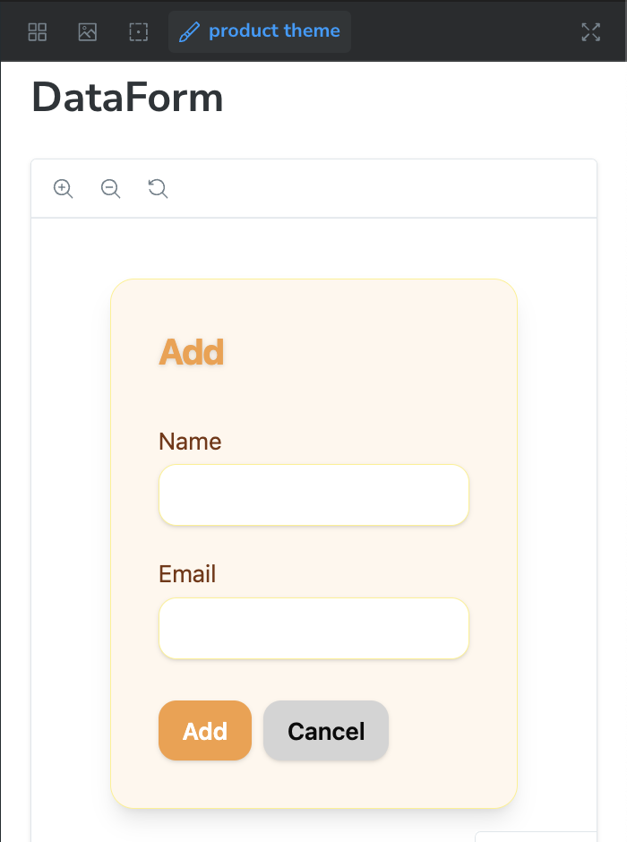
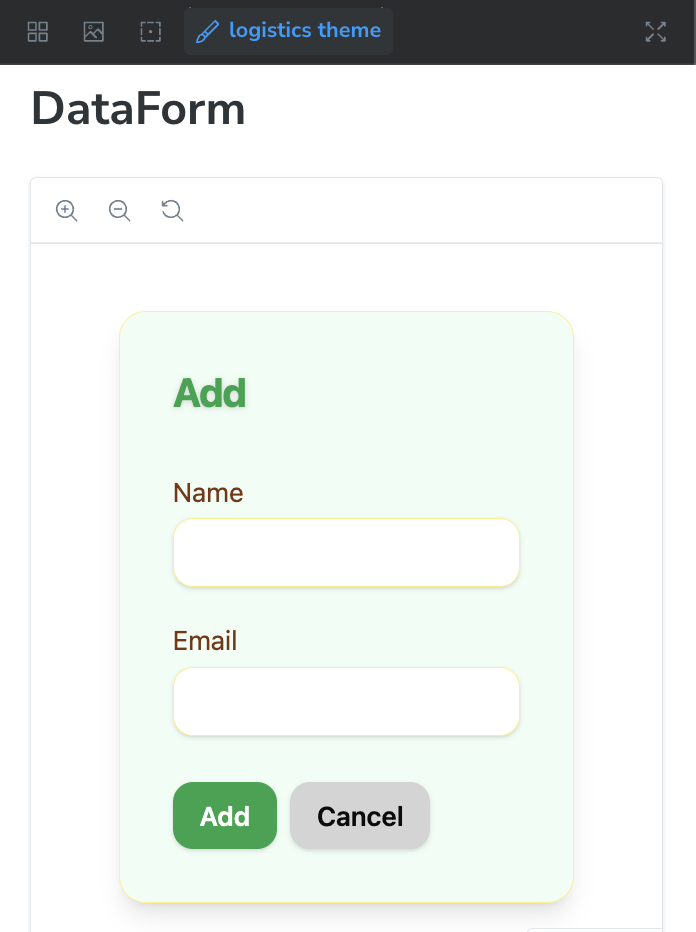
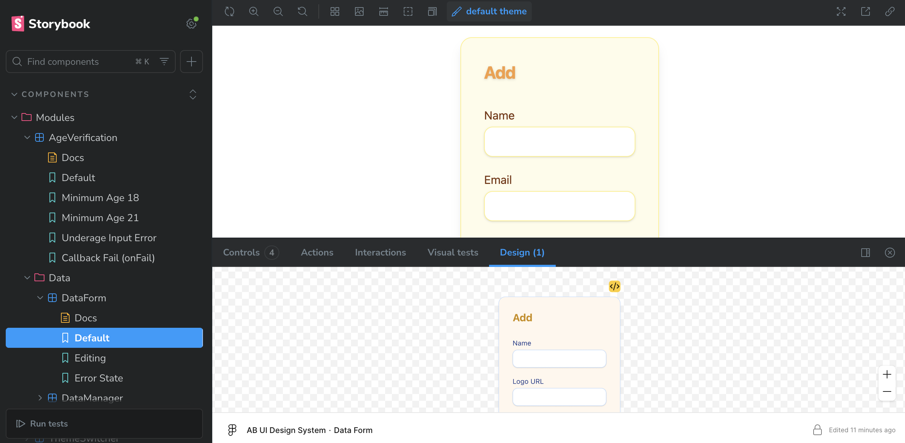
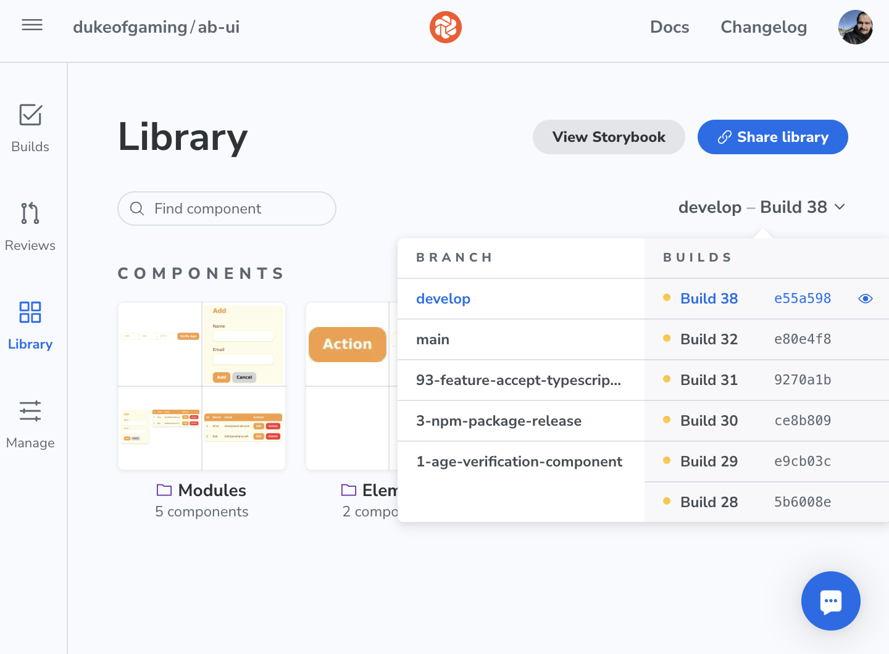
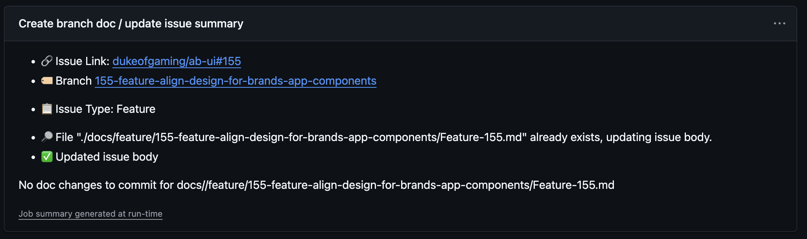
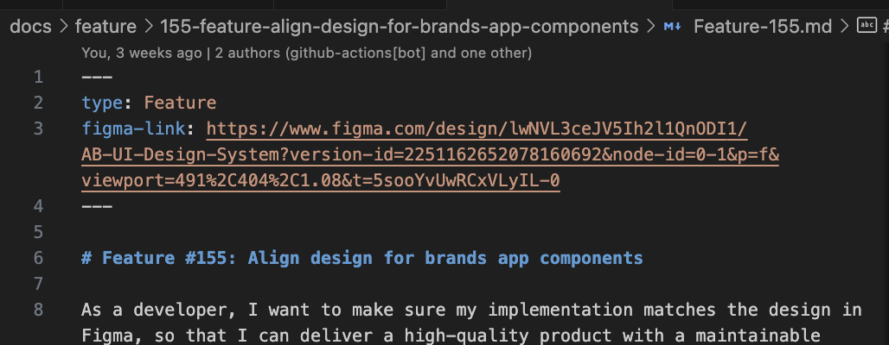

# Review & Demo
## David Vega

---

# **Requirement #1**: Configurable Design System

---

## **Requirement #1**: Configurable Design System
### **1.1** Accommodate multiple color palettes for logical application grouping

---

To manage multiple color palettes while streamlining the <u>designer</u> ↔ <u>developer</u> communication flow, <u>semantic design tokens</u> were chosen.

```js
{
  "global": {
    "color": {
      "canvas": {
        "value": "#fefce9",
        "type": "color",
        "description": "Default background color"
      },
      "content": {
        ...
      },
      "accent": {
       ...
      },
```

---

**Style Dictionary** was used to create themes with **Tailwind 4**. 

...and nerding out a bit in UX, psychology, and color, the semantic tokens were given gestaltic names, meaning semantics were aligned with psychology of perception.

> *gestalt*: in psychology, it expplains perception through how the brain groups objects into meaningful patterns.

- 👁️ Tokens encode perception (figure-ground separaation in gestaltic terms), not pigments:
  - **Layers**: `canvas` → `surface` → `content`
  - **Boundaries**: `outline`
  - **Actions**: `accent`, `destructive`, `reversal`, `tempered`
- 🔉 Emphasis hierarchy (pre-attentive cues or "loudness")
- 👨‍🎨 Palette-agnostic semantics to give freedom to designers (names are meaningful but are not prescriptive, e.g. `destructive` doesn't have to be red). 

---

**Style Dictionary** processes the `design/tokens/tokens.json` file and exports `tokens.css` and `themes.css`.

```js
StyleDictionary.registerFormat({
  name: 'css/themeClasses',
  format: function({ dictionary }) {
    const themeGroups = {};
    dictionary.allTokens.forEach(token => {
      const themeKey = token.path[0];
      if (!themeGroups[themeKey]) themeGroups[themeKey] = [];
      themeGroups[themeKey].push(token);
    });
    return Object.entries(themeGroups)
      .map(([themeKey, tokens]) => {
        const className = `.theme-${themeKey.replace(/^theme[/-]/, '').replace(/\//g, '-')}`;
        const lines = tokens.map(
          t => `  --global-color-${t.path[2]}: ${t.value};`
        );
        return `${className} {\n${lines.join('\n')}\n}`;
      })
      .join('\n');
  }
});
```

---

`tokens.css` contains the global CSS variables.

```css
:root {
  --global-color-canvas: #fefce9;
  --global-color-content: #78350f;
  --global-color-accent: #f59e42;
  --global-color-outline: #fef08a;
  ...
}
```

---

`themes.css` contains overrides for global CSS variables.

```css
.theme-orders {
  --global-color-canvas: #eef2ff;
  --global-color-content: #312e81;
  --global-color-accent: #14b8a6;
  --global-color-outline: #c7d2fe;
  ...
}
.theme-logistics {
  --global-color-canvas: #f0fdf4;
  --global-color-content: #0f172a;
  --global-color-accent: #16a34a;
  --global-color-outline: #bbf7d0;
  ...
}
...
```

---

Then we import the CSS files in `index.css`, and map them to Tailwind 4 theme variables.

```css
@import "tailwindcss";

@import './tokens.css';
@import './themes.css';

@theme {
  --color-accent      : var(--global-color-accent);
  --color-canvas      : var(--global-color-canvas);
  --color-content     : var(--global-color-content);
  --color-destructive : var(--global-color-destructive);
  --color-outline     : var(--global-color-outline);
  --color-surface     : var(--global-color-surface);

  --font-sans       : var(--global-font-sans);
  --font-mono       : var(--global-font-mono);
}
```

---

Design tokens become the source of truth for styles, that result in Tailwind utility classes (e.g. `text-accent`, `bg-destructive`, `border-accent`, etc.)



---

## **Requirement #1**: Configurable Design System
### **1.2** Allow theming or restyling without altering core component logic.

---

This is where Tailwind 4 and it's utility-first approach shine. `text-<color>`, `bg-<color>`, `border-<color>`, etc., become utility classes that can be used for components. Other colors can be overloaded with the `@theme` rule.

<table>
  <tr>
    <td></td>
    <td></td>
  </tr>
</table>

---

And the code is the same, where classes remain semantic.

```tsx
    <form
      className={[
        "bg-surface",
        ...
        "border-outline",
        ...
      ].join(" ")}
      onSubmit={onSubmit}
    >
      <h2
        className={[
          ...
          "text-accent",
          ...
        ].join(" ")}
      >
        {editingId ? "Edit" : "Add"}
      </h2>
      ...
```

---

# **Requirement #2**: Version-Controlled Components

---

## **Requirement #2**: Version-Controlled Components
### **2.1**: Maintain a single source of truth for design assets (Figma, Sketch, etc.) mapped to frontend component versions.

---

**Storybook** using the [Designs Addon](https://storybook.js.org/addons/storybook-addon-designs) allowed viewing designs from **Figma**. 



---

```tsx
const meta: Meta<typeof DataForm<User>> = {
  title       : 'Components/Modules/Data/DataForm',
  component   : DataForm,
  tags        : ['autodocs'],
  parameters  : {
    layout: 'centered',
    design: {
      type: 'figma',
      url: 'https://www.figma.com/design/lwNVL3ceJV5Ih2l1QnODI1/AB-UI-Design-System?node-id=769-50&m=dev',
    }
  },
};
```

---

## **Requirement #2**: Version-Controlled Components
### **2.1**: Provide clear lineage between design revisions, code commits, and semantic releases.
---


To have bidirectional mapping, the Storybook  and the [Storybook Connect](https://www.figma.com/community/plugin/1056265616080331589/storybook-connect) plugin were used. And in this direction, it is possible to point to specific versions of components, thanks to Chromatic.




---

## **Requirement #3**: Version-Controlled Application Blueprints

---

## **Requirement #3**: Version-Controlled Application Blueprints
### **3.1**: Keep application designs fully tracked and linked to corresponding codebase updates.

---

Since pointing to specific versions of design assets is not as intuitive, from the developer's side, a GitHub action was creted to create a branch Markdown file (see example [build run](https://github.com/dukeofgaming/ab-ui/actions/runs/17389342161))




---

## **Requirement #3**: Version-Controlled Application Blueprints
### **3.2**: Tie feature branches and releases directly to specific design documents.

---

In addition to Storybook Designs addon and Chromatic, the branch docs are created automatically when opening a PR to encourage journaling notes, as well as linking to Figma at the moment of starting a change. 



---

This approach is called "Docs as Code" and is detailed in [ADR #3](../../ADRs/3-LowOverheadLiveDocumentation/ADR-3.md)

Docs as Code has organic value for developers, as it helps with handovers, code reviews, design and architecture, So it improves Developer Experience when writing documentation, instead of adding extra work.

---

Most importantly, the Github Action verifying the branch docs exist can optionally be enforced as a quality gate, since it checks the YAML frontmatter.

Good developer processes don't add cognitive effort nor require policing.

---

## **Requirement #4**: Independent Library Versioning

---

## **Requirement #4**: Independent Library Versioning
### **4.1**: Use a mechanism (e.g., semantic versioning) to facilitate controlled, incremental upgrades of shared components.

---

...

---

## **Requirement #4**: Independent Library Versioning
### **4.2**: Allow multiple component library versions to coexist without breaking existing applications.

---

...

---

## **Requirement #5**: Repository Strategy

---

## **Requirement #5**: Repository Strategy
### **5.1**: Minimize the total number of repos while avoiding a monolithic structure.

---

...

---

## **Requirement #5**: Repository Strategy
### **5.2**: Consider a monorepo for shared libraries and micro-repos/packages for individual apps.

---

...

---

## **Requirement #6**: Collaboration and Contributions

---

## **Requirement #6**: Collaboration and Contributions
### **6.1**: Streamline contributions from a large developer community through local dev setups, peer-review workflows, and automated checks.

---

...

---

## **Requirement #6**: Collaboration and Contributions
### **6.2**: Prevent design drift by enforcing consistency between component implementation and design specifications.

---

...

---

## **Requirement #7**: Release Notes and Documentation

---

## **Requirement #7**: Release Notes and Documentation
### **7.1**: Automatically generate release notes, highlighting changes, deprecations, and upgrade paths.

---

...

---

## **Requirement #7**: Release Notes and Documentation
### **7.2**: Keep documentation synchronized with each component and its version.

---

...

---

## **Requirement #8**: Large-Scale Application Management

---

## **Requirement #8**: Large-Scale Application Management
### **8.1**: Provide a simple mechanism for teams to independently maintain, upgrade, or retire applications.

---

...

---

## **Requirement #8**: Large-Scale Application Management
### **8.2**: Preserve consistent UX and unified design standards across all apps.

---

...

---

